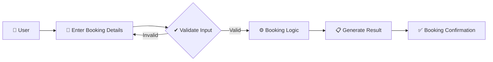
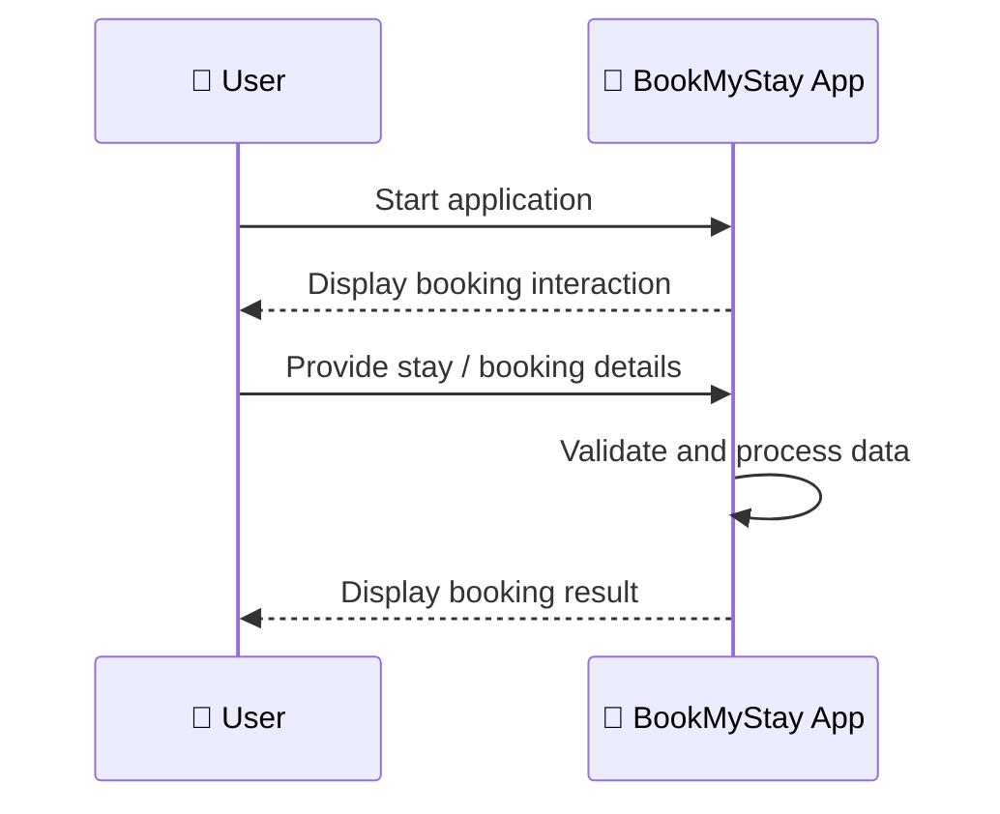
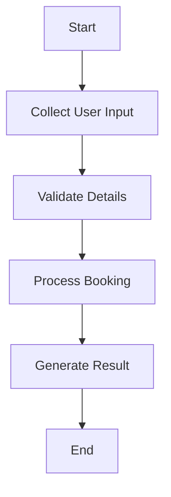
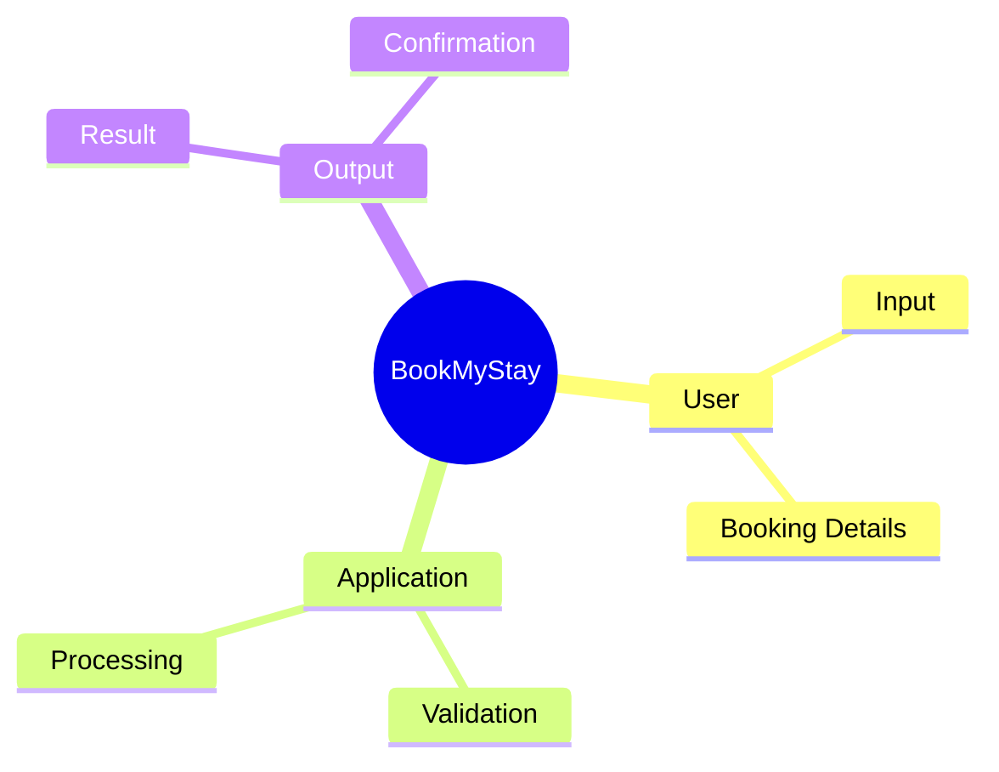

# 🏨 BookMyStay

<p align="center">
  <b>A Java-based hotel stay booking project that models a simple booking journey from user input to confirmation.</b>
</p>

<p align="center">
  
  
</p>

---

## ✨ What is BookMyStay?

**BookMyStay** is a compact Java application built to demonstrate the core logic behind a stay-booking workflow. The project focuses on taking user choices and booking information, processing those inputs through application logic, and producing a booking result.

It is a small project, but the workflow mirrors the same fundamental stages used by larger reservation systems: **input → validation → processing → confirmation**.

## 🎯 Key Highlights

| Feature | Description |
|---|---|
| 👤 User Interaction | Accepts booking-related input |
| 🏨 Booking Flow | Organizes the journey from selection to result |
| ⚙️ Java Logic | Implements the application workflow in Java |
| 📚 Learning Focus | Demonstrates practical control flow and user interaction |

## 🏗️ Booking Architecture



## 🔄 How It Works



### Step-by-step

1. **Start the application** using the Java entry point.
2. **Provide the required booking information** through the program flow.
3. The application **processes and validates the supplied data**.
4. The booking logic produces the **final result or confirmation**.

## 🧠 Project Workflow



## 📂 Project Structure

```text
BookMyStay/
├── src/
│   └── Bookmystay.java
└── README.md
```

## 🚀 Run Locally

### Requirements
- Java Development Kit (JDK)

### Compile

```bash
javac src/Bookmystay.java
```

### Run

```bash
java -cp src Bookmystay
```

## 💡 What This Project Demonstrates

- Java program structure
- Console-based user interaction
- Input handling
- Application control flow
- Basic booking-style business logic

## 🗺️ Project Map



## 🔮 Future Improvements

- [ ] Add room availability management
- [ ] Add customer profiles
- [ ] Add persistent data storage
- [ ] Add cancellation and modification flows
- [ ] Build a graphical or web interface

---

### 👨‍💻 Created by **Priyanshu**

⭐ If you found this project interesting, consider giving it a star!
